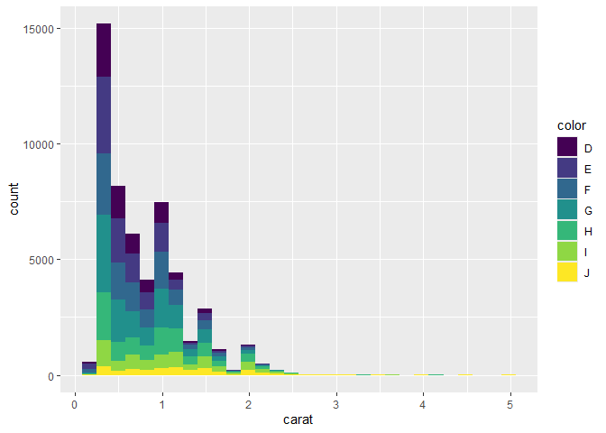

DSC1105_FA3
================
Lindsay Faith Bazar
February 28, 2025

``` r
data("diamonds")
```

## 1. Create a histogram on the diamonds dataset

``` r
ggplot(diamonds, aes(x = carat)) + 
  layer(
    geom = "bar",
    stat = "bin",
    position = "stack",
    mapping = aes(y = after_stat(count)),
    params = list(bins = 30)
  )
```

<!-- -->

## 2. Modify the histogram to use a different geom.

``` r
ggplot(data = diamonds, aes(x = carat)) + 
  layer(
    geom = "line",
    stat = "bin",
    position = "identity",
    mapping = aes(y = after_stat(count)),
    params = list(binwidth = 0.1)         
  )
```

<!-- -->

## 3. In your histogram, add an aesthetic mapping from one of the factor variables to the fill or color aesthetic.

``` r
ggplot(diamonds, aes(x = carat)) + 
  layer(
    geom="bar",
    stat="bin",
    position="stack",
    mapping= aes(y = after_stat(count), fill=color),
    params = list(bins = 30)
  )
```

<!-- -->

## 4. What is the default position adjustment for a histogram? Try changing the position adjustment in the histogram.

By default, histograms use position = “stack”, meaning bars are placed
on top of each other.

If we change it to position = “dodge”, bars will now be then placed side
by side.

``` r
ggplot(diamonds, aes(x = carat, fill = color)) +
  layer(
    geom = "bar",
    stat = "bin",
    position = "dodge",
    mapping = aes(y = after_stat(count)),
    params = list(bins = 30)
  )
```

<!-- -->
