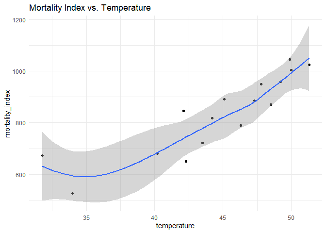
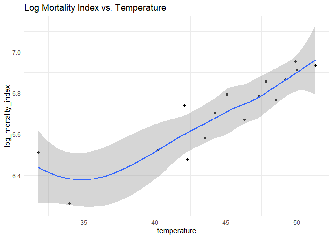
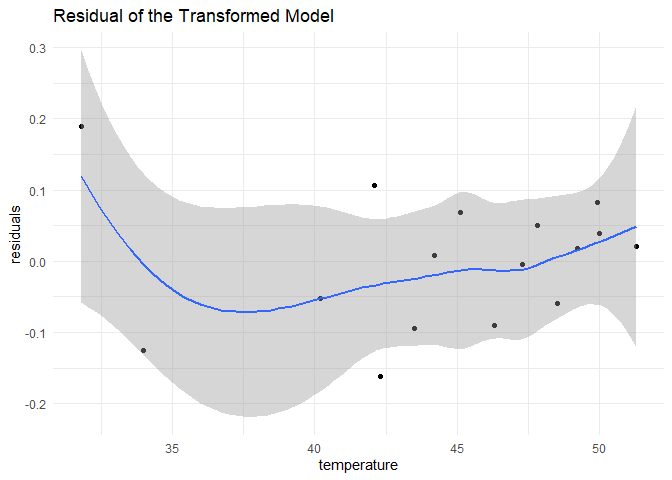
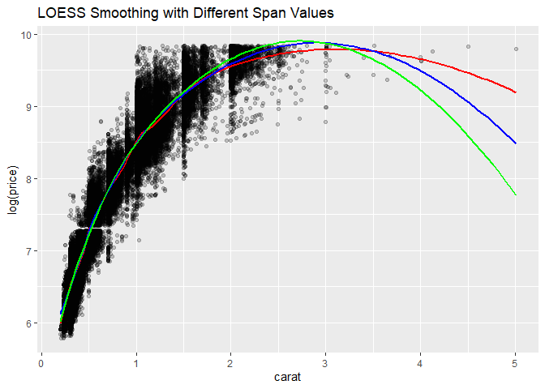
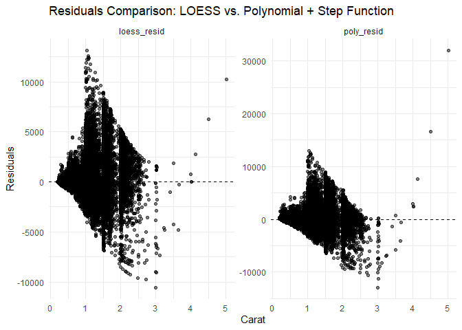

FA4 DSC1105
================
Lindsay Faith Bazar
March 07, 2025

## 1. Mortality vs.Temperature

``` r
suppressPackageStartupMessages({
  library(ggplot2)
  library(dplyr)
  library(tidyr)
})

data <- read.csv("mortality_by_latitude.csv")

colnames(data)
```

    ## [1] "latitude"        "mortality_index" "temperature"

``` r
summary(data)
```

    ##     latitude     mortality_index   temperature   
    ##  Min.   :50.00   Min.   : 525.0   Min.   :31.80  
    ##  1st Qu.:53.75   1st Qu.: 711.8   1st Qu.:42.25  
    ##  Median :57.50   Median : 858.0   Median :45.70  
    ##  Mean   :58.12   Mean   : 833.4   Mean   :44.59  
    ##  3rd Qu.:61.25   3rd Qu.: 952.2   3rd Qu.:48.67  
    ##  Max.   :70.00   Max.   :1045.0   Max.   :51.30

### Plot

``` r
p1 <- ggplot(data, aes(x = temperature, y = mortality_index)) +
  geom_point() +
  geom_smooth(method = "loess") +
  theme_minimal() +
  ggtitle("Mortality Index vs. Temperature")

print(p1)
```

    ## `geom_smooth()` using formula = 'y ~ x'

<!-- -->

The plot is hollow up because the curve dips a little at first and then
rises as the temperature increases. It has a slight U-shape, which means
the relationship between mortality index and temperature curves upward
rather than bending downward.

### Transformation

``` r
data <- data %>% mutate(log_mortality_index = log(mortality_index))

p2 <- ggplot(data, aes(x = temperature, y = log_mortality_index)) +
  geom_point() +
  geom_smooth(method = "loess") +
  theme_minimal() +
  ggtitle("Log Mortality Index vs. Temperature")

print(p2)
```

    ## `geom_smooth()` using formula = 'y ~ x'

<!-- -->

### Residuals

``` r
model <- lm(log_mortality_index ~ temperature, data = data)
data$residuals <- resid(model)

p3 <- ggplot(data, aes(x = temperature, y = residuals)) +
  geom_point() +
  geom_smooth(method = "loess") +
  theme_minimal() +
  ggtitle("Residual of the Transformed Model")

print(p3)
```

    ## `geom_smooth()` using formula = 'y ~ x'

<!-- -->

## 2. Diamond Dataset

``` r
data(diamonds)
diamonds_subset <- diamonds %>% filter(carat < 2.5)
```

### Span

``` r
ggplot(diamonds, aes(x = carat, y = log(price))) +
  geom_point(alpha = 0.2) +
  geom_smooth(method = "loess", span = 0.2, color = "red", size = 1, se = FALSE) +  
  geom_smooth(method = "loess", span = 0.5, color = "blue", size = 1, se = FALSE) + 
  geom_smooth(method = "loess", span = 0.8, color = "green", size = 1, se = FALSE) + 
  ggtitle("LOESS Smoothing with Different Span Values")
```

    ## `geom_smooth()` using formula = 'y ~ x'
    ## `geom_smooth()` using formula = 'y ~ x'
    ## `geom_smooth()` using formula = 'y ~ x'

<!-- -->

The span value controls how smooth or wiggly the curve is. The red line
uses a small span (0.2), so it responds to even the smallest change in
the data, making it appear more wiggly since it captures the smallest
details. The green line has the largest span (0.8), so it smooths out
the ups and downs, showing only the general trend, which miss some minor
details. The blue line (0.5) seems to capture the good balance of the
other two, it gives the overall trend without being too smooth or too
wiggly.

So if we wish to capture minor details, we use a smaller span (0.2). If
we just need the overall trend, we use the larger span (0.8). And if we
want both the details and the general trend, we use the middle span
(0.5)

## 3. Model Comparison

``` r
loess_fit <- loess(price ~ carat, data = diamonds)
diamonds$loess_resid <- residuals(loess_fit)

ggplot(diamonds, aes(x = carat, y = loess_resid)) +
  geom_point(color = "blue", alpha = 0.5) +
  geom_hline(yintercept = 0, linetype = "dashed") +
  labs(title = "Residuals of LOESS Model",
       x = "Carat", y = "Residuals") +
  theme_minimal()
```

<!-- -->

``` r
poly_model <- lm(price ~ poly(carat, 3) + cut, data = diamonds)
diamonds$poly_resid <- residuals(poly_model)

ggplot(diamonds, aes(x = carat, y = poly_resid)) +
  geom_point(color = "red", alpha = 0.5) +
  geom_hline(yintercept = 0, linetype = "dashed") +
  labs(title = "Residuals of Polynomial + Step Function Model",
       x = "Carat", y = "Residuals") +
  theme_minimal()
```

<!-- -->

### Side by side

``` r
diamonds_resid <- diamonds %>%
  select(carat, loess_resid, poly_resid) %>%
  pivot_longer(cols = c(loess_resid, poly_resid), names_to = "Model", values_to = "Residuals")

ggplot(diamonds_resid, aes(x = carat, y = Residuals)) +
  geom_point(alpha = 0.5) +
  geom_hline(yintercept = 0, linetype = "dashed") +
  facet_wrap(~ Model, scales = "free_y") +
  labs(title = "Residuals Comparison: LOESS vs. Polynomial + Step Function",
       x = "Carat", y = "Residuals") +
  theme_minimal()
```

<!-- -->

Residuals measure how far off a model’s predictions are from actual
values. In the LOESS plot, residuals seems to be spread out evenly, with
no clear pattern. While the polynomial + step function seems to cluster
in certain areas. In this regard, LOESS is more faithful because it has
no obvious structure and doesn’t leave a clear pattern.
