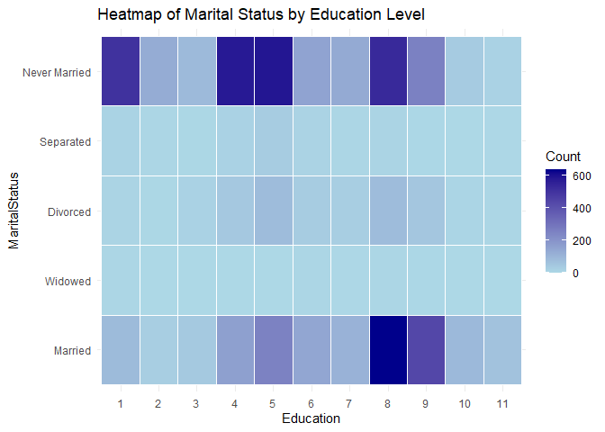
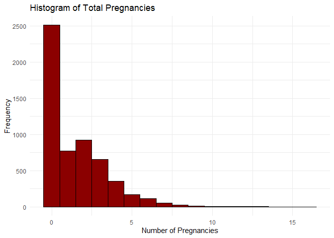
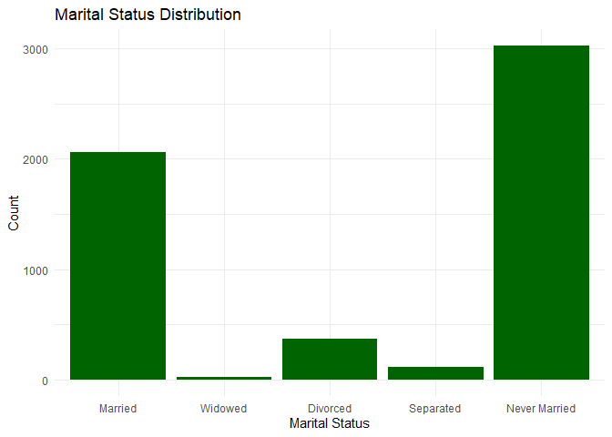
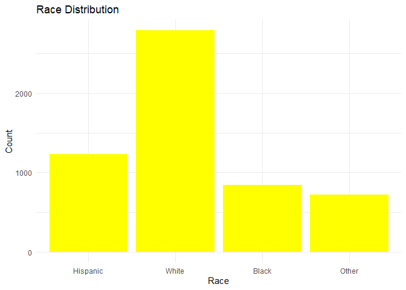
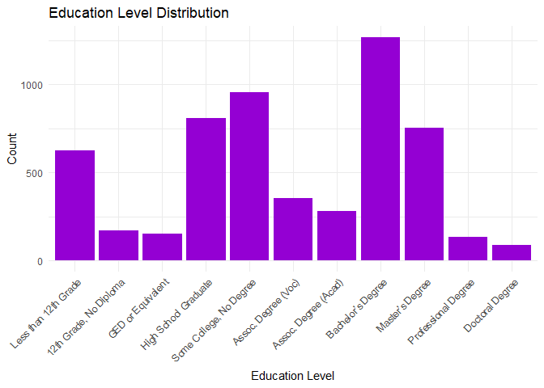
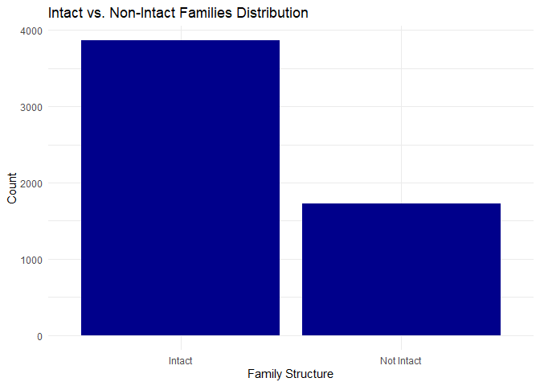
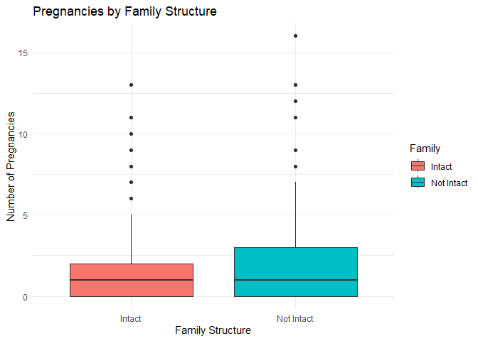
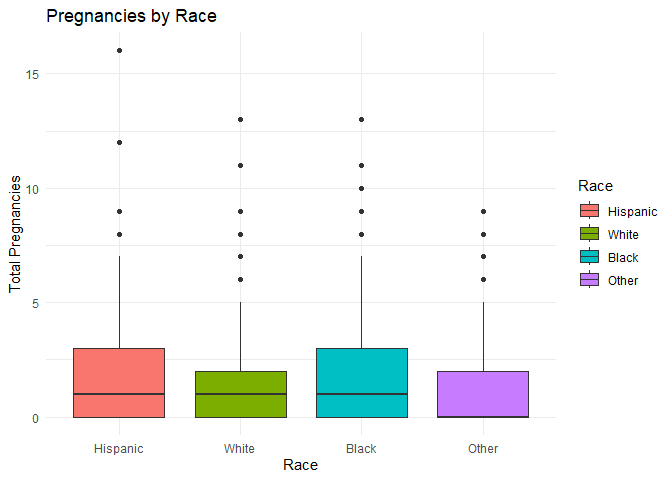
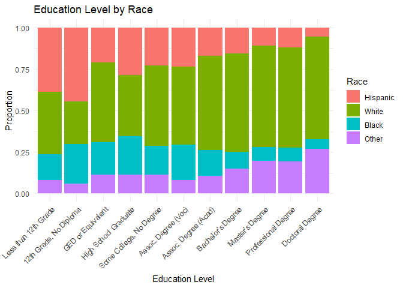

SA2 DSC1105
================
Lindsay Faith Bazar and Jade Marco Morillo
May 20, 2025

## **Introduction**

    This study focuses on identifying social and demographic predictors
of pregnancy outcomes among women in the United States. The data used in
this study come from the 2022–2023 Female Respondent Public Use File of
the National Survey of Family Growth (NSFG), a nationally representative
survey conducted by the National Center for Health Statistics (NCHS).
The survey collects detailed information about family life, reproductive
health, marriage, contraception, and related topics from women aged
15–49 in the U.S.

    The primary objective of this analysis is to examine how a woman’s
background, education, marital status, and family structure relate to
the total number of pregnancies a woman have. Using Poisson and negative
binomial regression models, this study explores the associations between
these predictors and pregnancy numbers. Additional statistical methods,
including ordinal and multinomial logistic regression, chi-square tests,
and data visualizations, are used to support a deeper understanding of
patterns in the data.

``` r
data <- read_csv("NSFG_2022_2023_FemRespPUFData.csv")
```

    ## Rows: 5586 Columns: 1912
    ## ── Column specification ────────────────────────────────────────────────────────
    ## Delimiter: ","
    ## chr    (1): DEVICE_TYPE
    ## dbl (1817): CaseID, RSCRAGE, RSCRNINF, RSCRHISP, RSCRRACE, FTFMODE, AGE_R, A...
    ## lgl   (94): TRYADOPT_02, TRYADOPT_03, BIONUMHX_4, MARENDHX_4, ENDMARRX_Y_4, ...
    ## 
    ## ℹ Use `spec()` to retrieve the full column specification for this data.
    ## ℹ Specify the column types or set `show_col_types = FALSE` to quiet this message.

``` r
data
```

    ## # A tibble: 5,586 × 1,912
    ##    CaseID RSCRAGE RSCRNINF RSCRHISP RSCRRACE FTFMODE DEVICE_TYPE AGE_R AGESCRN
    ##     <dbl>   <dbl>    <dbl>    <dbl>    <dbl>   <dbl> <chr>       <dbl>   <dbl>
    ##  1  96064      29        5        5        3       2 Mobile         29      29
    ##  2  96066      18        5        1        4       2 PC             18      18
    ##  3  96068      37        1        5        2       2 Mobile         37      37
    ##  4  96071      40        1        5        3       2 PC             40      40
    ##  5  96072      49        1        5        2       2 PC             49      49
    ##  6  96074      30        1        5        2       2 Mobile         30      30
    ##  7  96075      25        5        5        2       2 Mobile         25      25
    ##  8  96080      37        1        5        3       2 Mobile         37      37
    ##  9  96081      44        5        5        3       2 Mobile         44      44
    ## 10  96082      44        1        5        3       2 Mobile         44      44
    ## # ℹ 5,576 more rows
    ## # ℹ 1,903 more variables: HISP <dbl>, HISPGRP <dbl>, ROSCNT <dbl>,
    ## #   NUMCHILD <dbl>, HHKIDS18 <dbl>, NONBIOKIDS <dbl>, MARSTAT <dbl>,
    ## #   LMARSTAT <dbl>, RMARIT <dbl>, EVRMARRY <dbl>, SSMARCOH <dbl>, MANREL <dbl>,
    ## #   EARNHS_Y <dbl>, MYSCHOL_Y <dbl>, EARNBA_Y <dbl>, WTHPARNW <dbl>,
    ## #   ONOWN <dbl>, ONOWN18 <dbl>, INTACT <dbl>, PARMARR <dbl>, INTACT18 <dbl>,
    ## #   LVSIT14F <dbl>, LVSIT14M <dbl>, WOMRASDU <dbl>, MOMWORKD <dbl>, …

A subset of variables was selected for this analysis:

| Variable | Description |
|:---|:---|
| PREGNUM | Total number of pregnancies reported by the respondent (response variable). |
| FMARITAL | Current formal marital status of the respondent (e.g., married, divorced, never married). |
| HISPRACE2 | Respondent’s race and Hispanic origin, categorized as White, Black, or Other. |
| HIEDUC | Highest level of education completed by the respondent, treated as an ordered categorical variable. |
| AGER | Age of the respondent at the time of the interview (continuous variable). |
| EDUCMOM | Education level of the respondent’s mother or female caregiver, used as a proxy for childhood socioeconomic background. |
| INTCTFAM | Indicates whether the respondent grew up in an intact family (i.e., living with both biological or adoptive parents). |

## **Variable Selection**

#### ***Dependent Variable ($Y$)***

**Count Variable**

`PREGNUM` - Total Number of Pregnancies

This is the main outcome of the analysis. We want to understand what
factors are are related to how many times a woman has been pregnant.

``` r
summary(data$PREGNUM)
```

    ##    Min. 1st Qu.  Median    Mean 3rd Qu.    Max. 
    ##   0.000   0.000   1.000   1.476   2.000  16.000

#### ***Independent Variable ($X_i$)***

**Categorical (nominal)**

`FMARITAL` - Marital Status

Whether someone is married, divorced, or never married can influences
their chances of getting pregnant. For example, married women might be
more likely to plan for children.

``` r
summary(data$FMARITAL)
```

    ##    Min. 1st Qu.  Median    Mean 3rd Qu.    Max. 
    ##   1.000   1.000   5.000   3.361   5.000   5.000

`HISPRACE2` - Race and Hispanic Origin

This can help see if pregnancy patterns are different across group,
possibly due to things like culture or access to healthcare.

``` r
summary(data$FMARITAL)
```

    ##    Min. 1st Qu.  Median    Mean 3rd Qu.    Max. 
    ##   1.000   1.000   5.000   3.361   5.000   5.000

**Ordered Categorical**

`HIEDUC` - Highest Educational Level

For example, women with more education might focus on school or work
first and have fewer, later, or no plans of pregnancies.

``` r
summary(data$HIEDUC)
```

    ##    Min. 1st Qu.  Median    Mean 3rd Qu.    Max. 
    ##   1.000   4.000   6.000   5.863   8.000  11.000

**Demographics**

`AGER` - Age

The older someone is, the more time they’ve had to potentially have
pregnancies.

``` r
summary(data$AGER)
```

    ##    Min. 1st Qu.  Median    Mean 3rd Qu.    Max. 
    ##   15.00   25.00   33.00   32.36   40.00   50.00

`EDUCMOM`- Mother’s Education

Growing up with an educated mother might shape attitudes towards family
planning.

``` r
summary(data$EDUCMOM)
```

    ##    Min. 1st Qu.  Median    Mean 3rd Qu.    Max. 
    ##   1.000   2.000   3.000   3.926   4.000  95.000

`INTCTFAM` - Grew Up in an Intact Family or Not

This looks at whether women lived with both parents growing up. Family
structure might affect emotional development and future life choices,
including when or whether to have children.

``` r
summary(data$INTCTFAM)
```

    ##    Min. 1st Qu.  Median    Mean 3rd Qu.    Max. 
    ##   1.000   1.000   1.000   1.309   2.000   2.000

## **Data Cleaning**

**Checking null values:**

``` r
vars <- c("PREGNUM", "FMARITAL", "HIEDUC", "HISPRACE2", "AGER", "EDUCMOM", "INTCTFAM")

sapply(data[vars], function(x) sum(is.na(x)))
```

    ##   PREGNUM  FMARITAL    HIEDUC HISPRACE2      AGER   EDUCMOM  INTCTFAM 
    ##         0         0         0         0         0         0         0

**Recoding categorical variables:**

``` r
data <- data %>%
  mutate(
    FMARITAL = factor(FMARITAL,
                      levels = c(1, 2, 3, 4, 5),
                      labels = c("Married", "Widowed", "Divorced", "Separated", "Never Married")),
    HISPRACE2 = factor(HISPRACE2,
                       levels = c(1, 2, 3, 4),
                       labels = c("Hispanic", "White", "Black", "Other")),
    HIEDUC = factor(HIEDUC, ordered = TRUE), 
    EDUCMOM = factor(EDUCMOM, ordered = TRUE),
    INTCTFAM = factor(INTCTFAM, levels = c(1, 2), labels = c("Intact", "Not Intact"))
  )
```

## **Statistical Analyses**

#### **Poisson Regression**

``` r
poisson_model <- glm(PREGNUM ~ FMARITAL + HISPRACE2 + HIEDUC + AGER + EDUCMOM + INTCTFAM,                  family = poisson(link = "log"),
                     data = data)
```

``` r
summary(poisson_model)
```

    ## 
    ## Call:
    ## glm(formula = PREGNUM ~ FMARITAL + HISPRACE2 + HIEDUC + AGER + 
    ##     EDUCMOM + INTCTFAM, family = poisson(link = "log"), data = data)
    ## 
    ## Coefficients:
    ##                        Estimate Std. Error z value Pr(>|z|)    
    ## (Intercept)           -0.892588   0.066881 -13.346  < 2e-16 ***
    ## FMARITALWidowed       -0.262698   0.127781  -2.056 0.039797 *  
    ## FMARITALDivorced      -0.158446   0.037558  -4.219 2.46e-05 ***
    ## FMARITALSeparated     -0.049787   0.058604  -0.850 0.395579    
    ## FMARITALNever Married -0.783609   0.028664 -27.338  < 2e-16 ***
    ## HISPRACE2White        -0.061340   0.031257  -1.962 0.049709 *  
    ## HISPRACE2Black         0.266027   0.036959   7.198 6.12e-13 ***
    ## HISPRACE2Other        -0.150477   0.042451  -3.545 0.000393 ***
    ## HIEDUC.L              -0.584296   0.065571  -8.911  < 2e-16 ***
    ## HIEDUC.Q              -0.145761   0.056741  -2.569 0.010202 *  
    ## HIEDUC.C               0.320143   0.051383   6.231 4.65e-10 ***
    ## HIEDUC^4              -0.005446   0.054696  -0.100 0.920690    
    ## HIEDUC^5               0.060968   0.054196   1.125 0.260601    
    ## HIEDUC^6              -0.098124   0.051321  -1.912 0.055878 .  
    ## HIEDUC^7              -0.037738   0.047820  -0.789 0.430015    
    ## HIEDUC^8              -0.012116   0.040001  -0.303 0.761971    
    ## HIEDUC^9              -0.007563   0.034637  -0.218 0.827159    
    ## HIEDUC^10              0.025773   0.036457   0.707 0.479595    
    ## AGER                   0.045455   0.001477  30.771  < 2e-16 ***
    ## EDUCMOM.L             -0.117960   0.056100  -2.103 0.035496 *  
    ## EDUCMOM.Q              0.173696   0.049688   3.496 0.000473 ***
    ## EDUCMOM.C              0.098009   0.034487   2.842 0.004485 ** 
    ## EDUCMOM^4              0.078696   0.024613   3.197 0.001387 ** 
    ## INTCTFAMNot Intact     0.229787   0.024145   9.517  < 2e-16 ***
    ## ---
    ## Signif. codes:  0 '***' 0.001 '**' 0.01 '*' 0.05 '.' 0.1 ' ' 1
    ## 
    ## (Dispersion parameter for poisson family taken to be 1)
    ## 
    ##     Null deviance: 12582.0  on 5585  degrees of freedom
    ## Residual deviance:  8731.9  on 5562  degrees of freedom
    ## AIC: 17206
    ## 
    ## Number of Fisher Scoring iterations: 6

To assess whether the Poisson regression model was appropriate, we
checked for overdispersion, by examining the ratio of the residual
deviance to its degrees of freedom.

``` r
dispersion <- sum(residuals(poisson_model, type = "pearson")^2) / poisson_model$df.residual
dispersion 
```

    ## [1] 1.63383

The Poisson regression model showed evidence of overdispersion
(dispersion statistic \> 1).

To address this, a Negative Binomial model was fitted to account for the
extra-Poisson variation.

``` r
nb_model <- glm.nb(PREGNUM ~ FMARITAL + HISPRACE2 + HIEDUC + AGER + EDUCMOM + INTCTFAM,
                     data = data)
summary(nb_model)
```

    ## 
    ## Call:
    ## glm.nb(formula = PREGNUM ~ FMARITAL + HISPRACE2 + HIEDUC + AGER + 
    ##     EDUCMOM + INTCTFAM, data = data, init.theta = 2.346770487, 
    ##     link = log)
    ## 
    ## Coefficients:
    ##                        Estimate Std. Error z value Pr(>|z|)    
    ## (Intercept)           -1.171003   0.088576 -13.220  < 2e-16 ***
    ## FMARITALWidowed       -0.308018   0.184903  -1.666  0.09575 .  
    ## FMARITALDivorced      -0.243232   0.054254  -4.483 7.35e-06 ***
    ## FMARITALSeparated     -0.083390   0.087683  -0.951  0.34158    
    ## FMARITALNever Married -0.876554   0.037591 -23.318  < 2e-16 ***
    ## HISPRACE2White        -0.062713   0.042515  -1.475  0.14019    
    ## HISPRACE2Black         0.323478   0.050895   6.356 2.07e-10 ***
    ## HISPRACE2Other        -0.165591   0.056771  -2.917  0.00354 ** 
    ## HIEDUC.L              -0.686856   0.089277  -7.694 1.43e-14 ***
    ## HIEDUC.Q              -0.218934   0.076444  -2.864  0.00418 ** 
    ## HIEDUC.C               0.415490   0.069475   5.980 2.23e-09 ***
    ## HIEDUC^4              -0.028068   0.074604  -0.376  0.70675    
    ## HIEDUC^5               0.078777   0.073555   1.071  0.28417    
    ## HIEDUC^6              -0.088840   0.070085  -1.268  0.20493    
    ## HIEDUC^7              -0.071344   0.065955  -1.082  0.27938    
    ## HIEDUC^8               0.019116   0.055448   0.345  0.73028    
    ## HIEDUC^9              -0.016349   0.047437  -0.345  0.73036    
    ## HIEDUC^10              0.042292   0.050256   0.842  0.40006    
    ## AGER                   0.054487   0.001976  27.568  < 2e-16 ***
    ## EDUCMOM.L             -0.130601   0.079521  -1.642  0.10052    
    ## EDUCMOM.Q              0.220303   0.070078   3.144  0.00167 ** 
    ## EDUCMOM.C              0.131053   0.047777   2.743  0.00609 ** 
    ## EDUCMOM^4              0.080844   0.033125   2.441  0.01466 *  
    ## INTCTFAMNot Intact     0.259201   0.033146   7.820 5.28e-15 ***
    ## ---
    ## Signif. codes:  0 '***' 0.001 '**' 0.01 '*' 0.05 '.' 0.1 ' ' 1
    ## 
    ## (Dispersion parameter for Negative Binomial(2.3468) family taken to be 1)
    ## 
    ##     Null deviance: 8370.1  on 5585  degrees of freedom
    ## Residual deviance: 5709.3  on 5562  degrees of freedom
    ## AIC: 16496
    ## 
    ## Number of Fisher Scoring iterations: 1
    ## 
    ## 
    ##               Theta:  2.347 
    ##           Std. Err.:  0.131 
    ## 
    ##  2 x log-likelihood:  -16445.707

Model fit was compared using the Akaike Information Criterion (AIC).

``` r
AIC(poisson_model, nb_model)
```

    ##               df      AIC
    ## poisson_model 24 17206.42
    ## nb_model      25 16495.71

The Negative Binomial model provided a better fit to the data, with a
lower AIC (X) compared to the Poisson model (Y). Based on these results,
the Negative Binomial model was considered the more appropriate model
for inference.

**Summary of significant predictors:**

``` r
coefs <- coef(nb_model)

IRRs <- exp(coefs)

percent_change <- (IRRs - 1) * 100

pvalues <- summary(nb_model)$coefficients[, "Pr(>|z|)"]

table <- data.frame(
  Estimate = coefs,
  IRR = IRRs,
  Percent_Change = round(percent_change, 2),
  P_Value = pvalues
)

significant_predictors <- table %>% filter(P_Value < 0.05)

significant_predictors
```

    ##                          Estimate       IRR Percent_Change       P_Value
    ## (Intercept)           -1.17100274 0.3100559         -68.99  6.699006e-40
    ## FMARITALDivorced      -0.24323236 0.7840893         -21.59  7.352042e-06
    ## FMARITALNever Married -0.87655424 0.4162146         -58.38 2.918191e-120
    ## HISPRACE2Black         0.32347775 1.3819254          38.19  2.074282e-10
    ## HISPRACE2Other        -0.16559115 0.8473926         -15.26  3.536329e-03
    ## HIEDUC.L              -0.68685607 0.5031555         -49.68  1.431509e-14
    ## HIEDUC.Q              -0.21893403 0.8033747         -19.66  4.183537e-03
    ## HIEDUC.C               0.41549045 1.5151136          51.51  2.226064e-09
    ## AGER                   0.05448669 1.0559984           5.60 2.716662e-167
    ## EDUCMOM.Q              0.22030261 1.2464539          24.65  1.668472e-03
    ## EDUCMOM.C              0.13105287 1.1400280          14.00  6.088342e-03
    ## EDUCMOM^4              0.08084384 1.0842016           8.42  1.466484e-02
    ## INTCTFAMNot Intact     0.25920087 1.2958941          29.59  5.281576e-15

  The negative binomial regression model revealed several important
factors associated with the number of pregnancies among women. Compared
to married women, those who were never married had 58% fewer pregnancies
(IRR = 0.42), and those who were divorced had 22% fewer pregnancies (IRR
= 0.78). Widowed women also had fewer pregnancies (IRR = 0.73).

  In terms of race, Black women had 38% more pregnancies than Hispanic
women (IRR = 1.38), while women classified as Other races had 15% fewer
(IRR = 0.85). White women had slightly fewer pregnancies (IRR = 0.94).

  Education showed a clear pattern: as education increased, the number
of pregnancies generally decreased. For example, the main trend
(HIEDUC.L) showed that each step up in education level was associated
with a 50% decrease in the number of pregnancies (IRR = 0.50).

  Age also had a strong positive effect: for each additional year of
age, the expected number of pregnancies increased by about 5.6% (IRR =
1.06), as older women naturally have had more time to become pregnant.

  Looking at background factors, women whose mothers had some college
education had 25% more pregnancies (IRR = 1.25), while those whose
mothers had less than high school had slightly fewer (IRR = 0.88).
Additionally, women who did not grow up in an intact family had 30% more
pregnancies than those who did (IRR = 1.30),

#### **Contingency Tables**

**Distribution of Marital Status by Education Level:**

``` r
ct <- table(na.omit(data[, c("FMARITAL", "HIEDUC")]))
ct
```

    ##                HIEDUC
    ## FMARITAL          1   2   3   4   5   6   7   8   9  10  11
    ##   Married        85  30  44 164 254 147 110 637 437  90  62
    ##   Widowed         5   0   1   1   1   5   2   6   3   0   1
    ##   Divorced       12   4  16  45  80  34  28  80  51   9   6
    ##   Separated      15   6   4  18  33  13   7  11   3   0   2
    ##   Never Married 506 129  88 579 588 154 135 533 258  36  18

**Chi-Square Test**

``` r
chi <- chisq.test(ct)
chi
```

    ## 
    ##  Pearson's Chi-squared test
    ## 
    ## data:  ct
    ## X-squared = 804.43, df = 40, p-value < 2.2e-16

The Pearson’s Chi-squared test of independence indicated a statistically
significant association between marital status and highest educational
level. (p \< 2.2e-16). This suggests that the distribution of education
levels differs significantly across marital status categories.

**Heatmap**

``` r
library(ggplot2)

ct_df <- as.data.frame(ct)
names(ct_df) <- c("MaritalStatus", "Education", "Count")

ggplot(ct_df, aes(x = Education, y = MaritalStatus, fill = Count)) +
  geom_tile(color = "white") +
  scale_fill_gradient(low = "lightblue", high = "darkblue") +
  labs(title = "Heatmap of Marital Status by Education Level") +
  theme_minimal()
```

<!-- -->

#### **Categorical Response Modeling**

**Ordinal Logistic Regression (HIEDUC)**

``` r
ord_model <- polr(HIEDUC ~ AGER + HISPRACE2 + INTCTFAM + EDUCMOM, data = data, Hess = TRUE)

summary(ord_model)
```

    ## Call:
    ## polr(formula = HIEDUC ~ AGER + HISPRACE2 + INTCTFAM + EDUCMOM, 
    ##     data = data, Hess = TRUE)
    ## 
    ## Coefficients:
    ##                       Value Std. Error t value
    ## AGER                0.08940    0.00282  31.700
    ## HISPRACE2White      0.41712    0.06688   6.237
    ## HISPRACE2Black     -0.08701    0.08194  -1.062
    ## HISPRACE2Other      0.82256    0.08788   9.360
    ## INTCTFAMNot Intact -0.61583    0.05362 -11.486
    ## EDUCMOM.L           0.59627    0.14481   4.118
    ## EDUCMOM.Q          -0.99603    0.12586  -7.914
    ## EDUCMOM.C          -0.49350    0.08275  -5.963
    ## EDUCMOM^4          -0.23277    0.05267  -4.420
    ## 
    ## Intercepts:
    ##       Value    Std. Error t value 
    ## 1|2     0.6613   0.1095     6.0382
    ## 2|3     0.9830   0.1088     9.0329
    ## 3|4     1.2296   0.1085    11.3299
    ## 4|5     2.2246   0.1101    20.2030
    ## 5|6     3.1571   0.1143    27.6332
    ## 6|7     3.4809   0.1157    30.0755
    ## 7|8     3.7430   0.1169    32.0222
    ## 8|9     5.1388   0.1242    41.3677
    ## 9|10    6.9035   0.1406    49.1129
    ## 10|11   7.8775   0.1634    48.2170
    ## 
    ## Residual Deviance: 21710.97 
    ## AIC: 21748.97

**Odd Ratios**

``` r
exp(coef(ord_model))
```

    ##               AGER     HISPRACE2White     HISPRACE2Black     HISPRACE2Other 
    ##          1.0935126          1.5175921          0.9166692          2.2763287 
    ## INTCTFAMNot Intact          EDUCMOM.L          EDUCMOM.Q          EDUCMOM.C 
    ##          0.5401950          1.8153335          0.3693430          0.6104877 
    ##          EDUCMOM^4 
    ##          0.7923370

An ordinal logistic regression revealed that age was positively
associated with higher educational attainment (OR = 1.09, p \< .001).
Compared to the hispanics, White individuals (OR = 1.52, p \< .001) and
those of Other races (OR = 2.28, p \< .001) had higher odds of achieving
higher education levels. Coming from a non-intact family significantly
reduced the odds of attaining higher education (OR = 0.54, p \< .001).
While maternal education showed a complex relationship, with both
significant positive and negative coefficients.

**Multinomial Logistic Regression (FMARITAL)**

``` r
library(nnet)


multi_model <- multinom(FMARITAL ~ AGER + HIEDUC + HISPRACE2 + INTCTFAM + EDUCMOM, data = data)
```

    ## # weights:  105 (80 variable)
    ## initial  value 8990.320179 
    ## iter  10 value 4788.946750
    ## iter  20 value 4570.514435
    ## iter  30 value 4329.546878
    ## iter  40 value 4307.172512
    ## iter  50 value 4294.564173
    ## iter  60 value 4288.023850
    ## iter  70 value 4285.055984
    ## iter  80 value 4284.876350
    ## iter  90 value 4284.793058
    ## final  value 4284.785665 
    ## converged

``` r
summary(multi_model)
```

    ## Call:
    ## multinom(formula = FMARITAL ~ AGER + HIEDUC + HISPRACE2 + INTCTFAM + 
    ##     EDUCMOM, data = data)
    ## 
    ## Coefficients:
    ##               (Intercept)         AGER  HIEDUC.L    HIEDUC.Q     HIEDUC.C
    ## Widowed        -13.847419  0.137375781 -1.137889 -3.73196753 -0.560036481
    ## Divorced        -3.876427  0.050830428 -0.673565 -0.85348318  0.508101102
    ## Separated       -3.910267  0.005557382 -6.890322 -2.37233086  2.144735718
    ## Never Married    4.250342 -0.122303787 -2.107126 -0.06123458  0.005483283
    ##                  HIEDUC^4    HIEDUC^5   HIEDUC^6   HIEDUC^7    HIEDUC^8
    ## Widowed        8.84971832  0.79895015 10.0186257 -0.9243043  5.03307640
    ## Divorced       0.24158043 -0.25925148  0.2446356 -0.2483576  0.12511021
    ## Separated      5.50734340  5.87235209  4.7724076  3.7886524  1.88801847
    ## Never Married -0.08568934 -0.03702391  0.1292377  0.1166894 -0.04385163
    ##                 HIEDUC^9  HIEDUC^10 HISPRACE2White HISPRACE2Black
    ## Widowed       0.13089716 -0.2711864     -0.3621942      1.2786401
    ## Divorced      0.01192105  0.2589399      0.1653316      0.6420555
    ## Separated     0.97614769  0.4730555     -0.8693778      0.7690865
    ## Never Married 0.03867706  0.1845408     -0.2263038      1.4364641
    ##               HISPRACE2Other INTCTFAMNot Intact  EDUCMOM.L   EDUCMOM.Q
    ## Widowed           0.30752855        -0.03306627 -5.5094246 -5.08976607
    ## Divorced         -0.44821199         0.27748924  0.1398526 -0.04459118
    ## Separated        -0.30105546         0.39735786  0.3038083  0.16505446
    ## Never Married     0.08609194         0.24118677  0.3141166 -0.25129469
    ##                 EDUCMOM.C   EDUCMOM^4
    ## Widowed       -3.16924676 -1.10716310
    ## Divorced       0.27030043  0.19048699
    ## Separated      0.33063935  0.20121662
    ## Never Married  0.07179422  0.06649254
    ## 
    ## Std. Errors:
    ##               (Intercept)        AGER  HIEDUC.L  HIEDUC.Q  HIEDUC.C  HIEDUC^4
    ## Widowed         1.6533935 0.039176289 0.7593761 0.7681827 0.8031961 0.6727713
    ## Divorced        0.3772580 0.008358290 0.3908232 0.3281538 0.2898631 0.3310172
    ## Separated       0.5167518 0.012248673 0.5211894 0.4657348 0.4729608 0.4529131
    ## Never Married   0.1883858 0.004633564 0.2174254 0.1900274 0.1743171 0.1862932
    ##                HIEDUC^5  HIEDUC^6  HIEDUC^7  HIEDUC^8  HIEDUC^9 HIEDUC^10
    ## Widowed       0.6191645 0.5111762 0.7702012 0.7282115 0.8167772 0.7384899
    ## Divorced      0.3505231 0.3315506 0.2853504 0.2264372 0.1814630 0.1809561
    ## Separated     0.3253042 0.3561902 0.4391397 0.4089524 0.3433274 0.3061782
    ## Never Married 0.1807431 0.1736410 0.1639437 0.1388889 0.1136678 0.1193634
    ##               HISPRACE2White HISPRACE2Black HISPRACE2Other INTCTFAMNot Intact
    ## Widowed           0.61882097      0.6517044      0.7155492         0.47028848
    ## Divorced          0.17079271      0.2269126      0.2514625         0.13044949
    ## Separated         0.27071404      0.2931462      0.3577169         0.20950772
    ## Never Married     0.09604306      0.1355093      0.1228875         0.07935933
    ##               EDUCMOM.L EDUCMOM.Q EDUCMOM.C  EDUCMOM^4
    ## Widowed       0.4447710 0.4695173 0.4044752 0.43421156
    ## Divorced      0.3107417 0.2737883 0.1858717 0.12522205
    ## Separated     0.4427407 0.3976491 0.2953838 0.22584163
    ## Never Married 0.2128769 0.1861256 0.1214668 0.07773155
    ## 
    ## Residual Deviance: 8569.571 
    ## AIC: 8729.571

**Odds-Ratios**

``` r
coefs <- summary(multi_model)$coefficients
se <- summary(multi_model)$standard.errors

zvals <- coefs / se
pvals <- 2 * (1 - pnorm(abs(zvals)))

multi_summary <- data.frame(
  Outcome = rep(rownames(coefs), each = ncol(coefs)),
  Predictor = rep(colnames(coefs), times = nrow(coefs)),
  OR = round(exp(c(coefs)), 3),
  p = round(c(pvals), 4)
)

multi_summary
```

    ##          Outcome          Predictor        OR      p
    ## 1        Widowed        (Intercept)     0.000 0.0000
    ## 2        Widowed               AGER     0.021 0.0000
    ## 3        Widowed           HIEDUC.L     0.020 0.0000
    ## 4        Widowed           HIEDUC.Q    70.129 0.0000
    ## 5        Widowed           HIEDUC.C     1.147 0.0005
    ## 6        Widowed           HIEDUC^4     1.052 0.0000
    ## 7        Widowed           HIEDUC^5     1.006 0.6500
    ## 8        Widowed           HIEDUC^6     0.885 0.0000
    ## 9        Widowed           HIEDUC^7     0.320 0.1340
    ## 10       Widowed           HIEDUC^8     0.510 0.0848
    ## 11       Widowed           HIEDUC^9     0.001 0.0000
    ## 12       Widowed          HIEDUC^10     0.122 0.0000
    ## 13       Widowed     HISPRACE2White     0.024 0.0000
    ## 14       Widowed     HISPRACE2Black     0.426 0.0093
    ## 15       Widowed     HISPRACE2Other     0.093 0.0000
    ## 16       Widowed INTCTFAMNot Intact     0.941 0.7473
    ## 17       Widowed          EDUCMOM.L     0.571 0.4856
    ## 18       Widowed          EDUCMOM.Q     1.662 0.0796
    ## 19       Widowed          EDUCMOM.C     8.540 0.0000
    ## 20       Widowed          EDUCMOM^4     1.005 0.9749
    ## 21      Divorced        (Intercept)  6972.425 0.0000
    ## 22      Divorced               AGER     1.273 0.4655
    ## 23      Divorced           HIEDUC.L   246.495 0.0000
    ## 24      Divorced           HIEDUC.Q     0.918 0.6455
    ## 25      Divorced           HIEDUC.C     2.223 0.1969
    ## 26      Divorced           HIEDUC^4     0.772 0.4595
    ## 27      Divorced           HIEDUC^5   355.083 0.0000
    ## 28      Divorced           HIEDUC^6     0.964 0.8377
    ## 29      Divorced           HIEDUC^7 22440.569 0.0000
    ## 30      Divorced           HIEDUC^8     1.277 0.4606
    ## 31      Divorced           HIEDUC^9   118.203 0.0000
    ## 32      Divorced          HIEDUC^10     1.138 0.4567
    ## 33      Divorced     HISPRACE2White     0.397 0.2301
    ## 34      Divorced     HISPRACE2Black     0.780 0.3841
    ## 35      Divorced     HISPRACE2Other    44.197 0.0000
    ## 36      Divorced INTCTFAMNot Intact     1.124 0.4766
    ## 37      Divorced          EDUCMOM.L   153.404 0.0000
    ## 38      Divorced          EDUCMOM.Q     1.133 0.5806
    ## 39      Divorced          EDUCMOM.C     6.606 0.0000
    ## 40      Divorced          EDUCMOM^4     0.957 0.7522
    ## 41     Separated        (Intercept)     1.140 0.8727
    ## 42     Separated               AGER     1.012 0.9476
    ## 43     Separated           HIEDUC.L     2.654 0.0045
    ## 44     Separated           HIEDUC.Q     1.039 0.7337
    ## 45     Separated           HIEDUC.C     0.762 0.7135
    ## 46     Separated           HIEDUC^4     1.296 0.1524
    ## 47     Separated           HIEDUC^5     1.605 0.1223
    ## 48     Separated           HIEDUC^6     1.203 0.1221
    ## 49     Separated           HIEDUC^7     0.696 0.5583
    ## 50     Separated           HIEDUC^8     1.180 0.3330
    ## 51     Separated           HIEDUC^9     0.419 0.0013
    ## 52     Separated          HIEDUC^10     0.797 0.0185
    ## 53     Separated     HISPRACE2White     3.592 0.0498
    ## 54     Separated     HISPRACE2Black     1.900 0.0047
    ## 55     Separated     HISPRACE2Other     2.158 0.0087
    ## 56     Separated INTCTFAMNot Intact     4.206 0.0000
    ## 57     Separated          EDUCMOM.L     1.360 0.6674
    ## 58     Separated          EDUCMOM.Q     0.639 0.0747
    ## 59     Separated          EDUCMOM.C     0.740 0.4000
    ## 60     Separated          EDUCMOM^4     1.090 0.4836
    ## 61 Never Married        (Intercept)     0.967 0.9439
    ## 62 Never Married               AGER     1.320 0.0334
    ## 63 Never Married           HIEDUC.L     1.488 0.0579
    ## 64 Never Married           HIEDUC.Q     1.273 0.0024
    ## 65 Never Married           HIEDUC.C     0.004 0.0000
    ## 66 Never Married           HIEDUC^4     1.150 0.6527
    ## 67 Never Married           HIEDUC^5     1.355 0.4926
    ## 68 Never Married           HIEDUC^6     1.369 0.1401
    ## 69 Never Married           HIEDUC^7     0.006 0.0000
    ## 70 Never Married           HIEDUC^8     0.956 0.8706
    ## 71 Never Married           HIEDUC^9     1.179 0.6781
    ## 72 Never Married          HIEDUC^10     0.778 0.1770
    ## 73 Never Married     HISPRACE2White     0.042 0.0000
    ## 74 Never Married     HISPRACE2Black     1.310 0.1459
    ## 75 Never Married     HISPRACE2Other     1.392 0.2630
    ## 76 Never Married INTCTFAMNot Intact     1.074 0.5545
    ## 77 Never Married          EDUCMOM.L     0.330 0.0108
    ## 78 Never Married          EDUCMOM.Q     1.210 0.1282
    ## 79 Never Married          EDUCMOM.C     1.223 0.3729
    ## 80 Never Married          EDUCMOM^4     1.069 0.3923

A multinomial logistic regression was used to examine how factors like
age, education (both respondent’s and mother’s), race/ethnicity and
family background affect marital status. The results showed that older
age increases the chances of being widowed — for every additional year,
the odds go up by 15% (OR = 1.15, p \< .001). Black individuals were
about 3.6 times more likely to be widowed (OR = 3.59, p = .009) compared
to Hispanic individuals.

When it comes to being separated, White respondents were 3.6 times more
likely (OR = 3.59, p = .050) and Black respondents were 1.9 times more
likely (OR = 1.90, p = .005) than Hispanics. Additionally, people from
non-intact families were over 4 times more likely to be separated (OR =
4.21, p \< .001).

For those never married, each year of age slightly decreased the odds
(OR = 0.88, p = .033). White individuals were much less likely to be
never married (OR = 0.042, p \< .001) compared to Hispanics. Higher
maternal education also reduced the chances of never marrying — for
example, a one-unit increase in a specific measure of maternal education
cut the odds by about 67% (OR = 0.33, p = .011).

**Model Fit**

``` r
library(pscl)

pR2(ord_model)
```

    ## fitting null model for pseudo-r2

    ##           llh       llhNull            G2      McFadden          r2ML 
    ## -1.085549e+04 -1.183263e+04  1.954282e+03  8.258024e-02  2.952088e-01 
    ##          r2CU 
    ##  2.995394e-01

``` r
pR2(multi_model)
```

    ## fitting null model for pseudo-r2
    ## # weights:  10 (4 variable)
    ## initial  value 8990.320179 
    ## iter  10 value 5486.601656
    ## final  value 5479.604946 
    ## converged

    ##           llh       llhNull            G2      McFadden          r2ML 
    ## -4284.7856651 -5479.6049458  2389.6385614     0.2180484     0.3480521 
    ##          r2CU 
    ##     0.4049897

We assessed the model fit for both the ordinal and multinomial logistic
regression models using pseudo-R² statistics. For the ordinal logistic
regression model, the McFadden’s R² was 0.083. The model explained
approximately 29.5% (r2ML) to 30.0% (r2CU) of the variation in the
outcome.

In comparison, the multinomial logistic regression model showed a better
fit, with a McFadden’s R² of 0.218. This model explained about 34.8%
(r2ML) to 40.5% (r2CU) of the variance in the outcome.

#### **EDA and Multiple Comparison**

**Charts**

``` r
ggplot(data, aes(x = PREGNUM)) +
  geom_histogram(binwidth = 1, fill = "darkred", color = "black") +
  labs(title = "Histogram of Total Pregnancies", x = "Number of Pregnancies", y = "Frequency") +
  theme_minimal()
```

<!-- -->

``` r
ggplot(data, aes(x = FMARITAL)) +
  geom_bar(fill = "darkgreen") +
  labs(title = "Marital Status Distribution", x = "Marital Status", y = "Count") +
  theme_minimal()
```

<!-- -->

``` r
ggplot(data, aes(x = HISPRACE2)) +
  geom_bar(fill = "yellow") +
    labs(title = "Race Distribution", x = "Race", y = "Count") +
  theme_minimal()
```

<!-- -->

``` r
data$HIEDUC_f <- factor(data$HIEDUC,
                        levels = 1:11,
                        labels = c("Less than 12th Grade",
                                   "12th Grade, No Diploma",
                                   "GED or Equivalent",
                                   "High School Graduate",
                                   "Some College, No Degree",
                                   "Assoc. Degree (Voc)",
                                   "Assoc. Degree (Acad)",
                                   "Bachelor’s Degree",
                                   "Master’s Degree",
                                   "Professional Degree",
                                   "Doctoral Degree"))


ggplot(data, aes(x = HIEDUC_f)) +
  geom_bar(fill = "darkviolet") +
  labs(title = "Education Level Distribution",
       x = "Education Level",
       y = "Count") +
  theme_minimal() +
  theme(axis.text.x = element_text(angle = 45, hjust = 1))
```

<!-- -->

``` r
ggplot(data, aes(x = INTCTFAM)) +
  geom_bar(fill="darkblue") +
  labs(title = "Intact vs. Non-Intact Families Distribution",
       x = "Family Structure",
       y = "Count") +
  theme_minimal()
```

<!-- -->

``` r
ggplot(data, aes(x = INTCTFAM, y = PREGNUM, fill = INTCTFAM)) +
  geom_boxplot() +
  labs(title = "Pregnancies by Family Structure",
       x = "Family Structure",
       y = "Number of Pregnancies",
       fill = "Family") +
  theme_minimal()
```

<!-- -->

``` r
ggplot(data, aes(x = HISPRACE2, y = PREGNUM, fill = HISPRACE2)) +
  geom_boxplot() +
  labs(title = "Pregnancies by Race", x = "Race", y = "Total Pregnancies", fill = "Race") +
  theme_minimal()
```

<!-- -->

``` r
ggplot(data, aes(x = HIEDUC_f, fill = HISPRACE2)) +
  geom_bar(position = "fill") + 
  labs(title = "Education Level by Race",
       x = "Education Level",
       y = "Proportion",
       fill = "Race") +
  theme_minimal() +
  theme(axis.text.x = element_text(angle = 45, hjust = 1))
```

<!-- -->

**Multiple Tests**

``` r
kruskal_test <- kruskal.test(PREGNUM ~ HISPRACE2, data = data)
kruskal_test
```

    ## 
    ##  Kruskal-Wallis rank sum test
    ## 
    ## data:  PREGNUM by HISPRACE2
    ## Kruskal-Wallis chi-squared = 38.536, df = 3, p-value = 2.177e-08

``` r
pairwise_result_fdr <- pairwise.wilcox.test(data$PREGNUM, data$HISPRACE2, p.adjust.method = "fdr")
pairwise_result_fdr
```

    ## 
    ##  Pairwise comparisons using Wilcoxon rank sum test with continuity correction 
    ## 
    ## data:  data$PREGNUM and data$HISPRACE2 
    ## 
    ##       Hispanic White   Black  
    ## White 0.05785  -       -      
    ## Black 0.01322  1.4e-05 -      
    ## Other 0.00022  0.00563 4.2e-08
    ## 
    ## P value adjustment method: fdr

We compared the total number of pregnancies among different race groups
using a Kruskal-Wallis test, which showed a significant difference (χ² =
38.54, p \< 0.001). To find out which of these groups differed, we did
pairwise Wilcoxon tests with False Discovery Rate (FDR) adjustments to
reduce false positives. Significant differences were found between
Hispanic and Other (p = 0.00022), White and Black (p = 0.00001), Black
and Other (p \< 0.00001), and Hispanic and Black (p = 0.01322).
